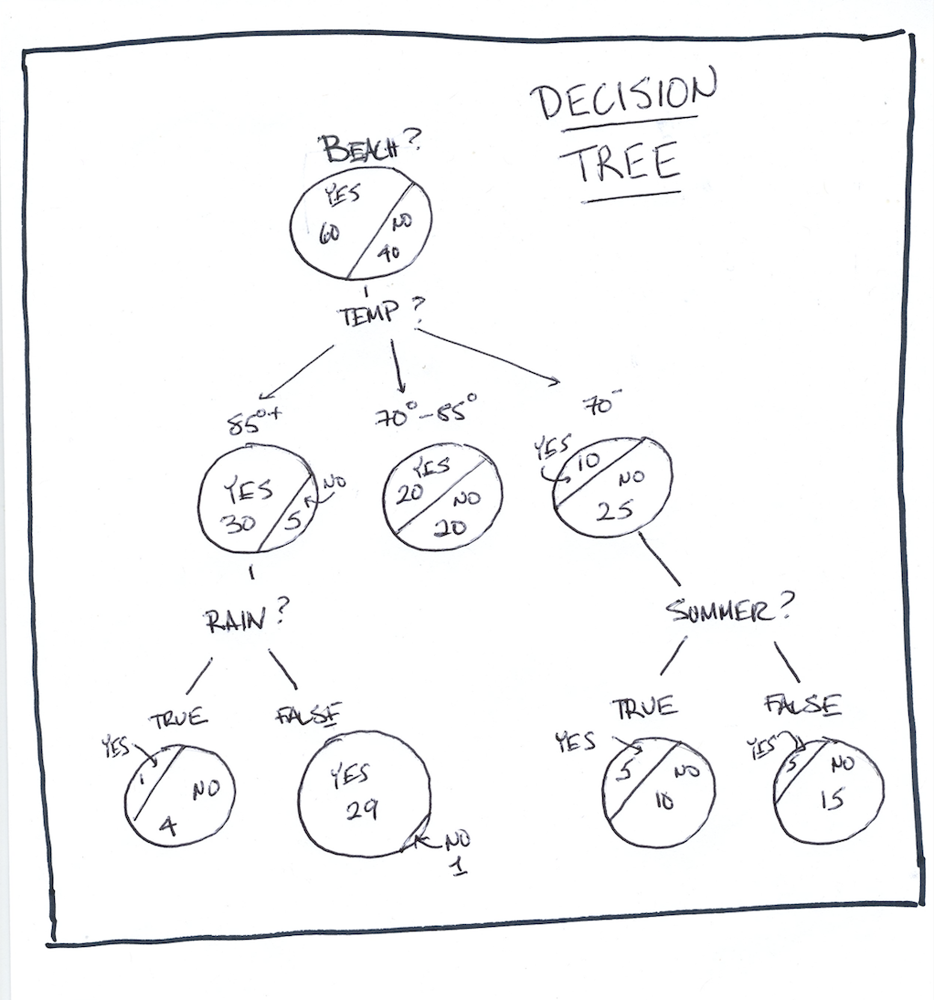
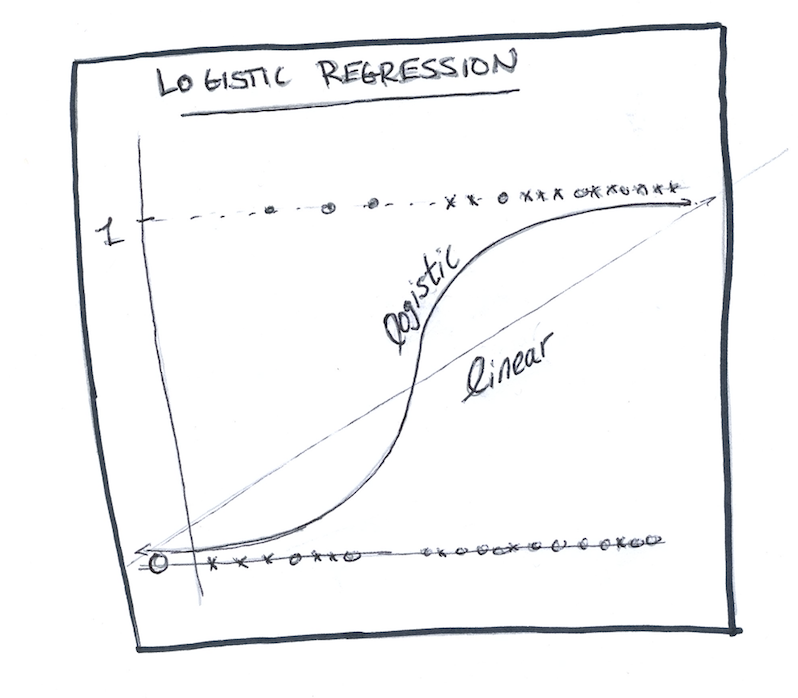
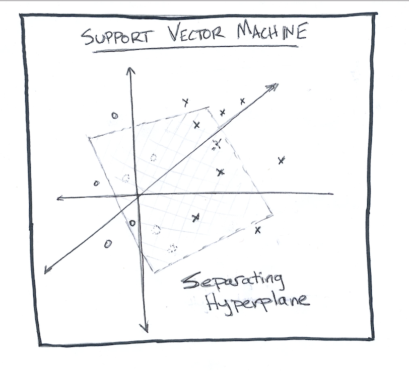
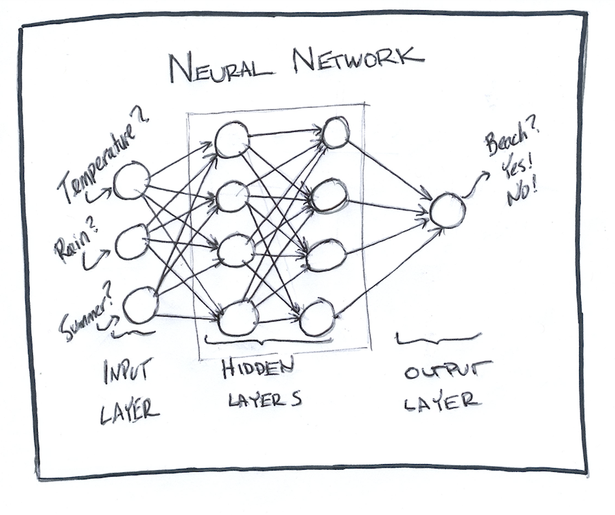
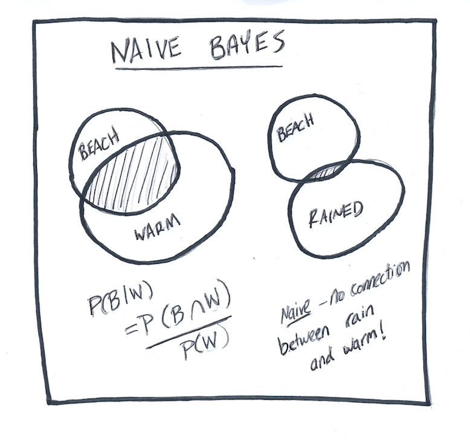

# ML-Course-Notes

Notes for ML course at UCSF Library

## Visuals

### Decision Tree

### Random Forest

### Logistic Regression

### Support Vector Machine

### Neural Net

### Naive Bayes

## Exercises

Swap out the Random Forest for a different ML algorithm. At their defaults, how do they perform?

See if you can get better performance from the Random Forest by changing some of the parameters. What does n_estimators do?

Take a look at the parameters for a vectorizer. What does ngram_range do? Can you view the output of the ngram range?

Try programming a rules based (as opposed to machine learning) approach. Can you beat these algorithms?
